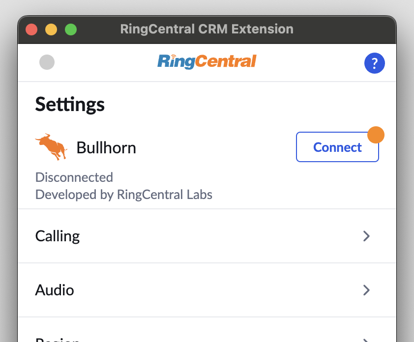
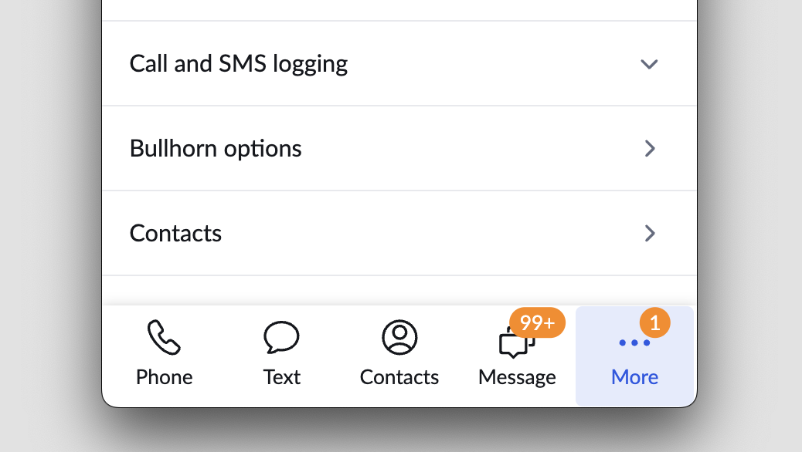
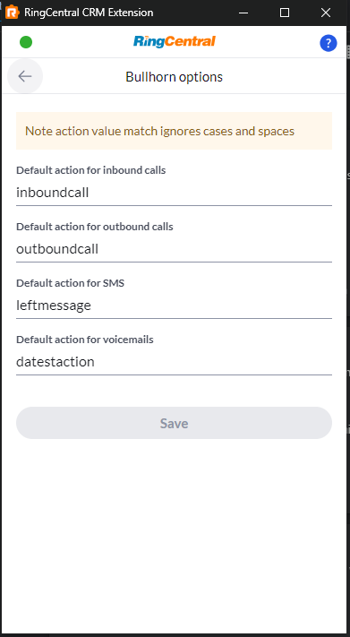

# Setting up the Unified CRM extension for Bullhorn

Bullhorn is the global leader in software for the staffing industry. More than 10,000 companies rely on Bullhorn’s cloud-based platform to power their staffing processes from start to finish. 

RingCentral's integration with Bullhorn helps streamline communications with candidates, and helps staffing agents better support candidates through the entire recruitment pipeline by helping to manage and store communication history for all candidates. 

## Install the extension

If you have not already done so, begin by [installing the Unified CRM extension](../getting-started.md) from the Chrome web store. 

<iframe width="825" height="464" src="https://www.youtube.com/embed/afbdQD0y4Yo?si=UKcBw2BP4pj2adNc" title="Unified CRM extension for Bullhorn - quick start" frameborder="0" allow="accelerometer; autoplay; clipboard-write; encrypted-media; gyroscope; picture-in-picture; web-share" allowfullscreen></iframe>

## Setup the extension

Once the extension has been installed, follow these steps to setup and configure the extension for Bullhorn. 

1. [Login to Bullhorn](https://www.bullhornstaffing.com/).

2. While visiting a Bullhorn application page, click the quick access button to bring the dialer to the foreground. 

3. Navigate to the Settings screen in the Unified CRM extension's CTI, and find the option labeled "bullhorn."

    { style="max-width: 200px" }

4. Click the "Connect" button. 

5. A window will be opened prompting you to enter your Bullhorn username and password. Login to Bullhorn. 

When you login successfully, the Chrome extension will automatically update to show you are connected to Bullhorn. If you are connected, the button next to Bullhorn will say, "logout".

And with that, you will be connected to Bullhorn and ready to begin using the integration. 

## Auto log with default Note Action preference setup

In Settings, there's a "Bullhorn Default Note Action" entry button.

We provide 4 most common cases here. Once you input the same Note Action string inside the field, the extension will try to find the assigned Note Action and select that for you on the log form page.

## Placeholder companies when creating contacts

Bullhorn requires that every contact be associated with a company. When logging calls for new contacts, the Unified CRM extension will first look for a company called, "Placeholder company." If a company with that name is not found, one will be created. Then the contact will be associated with that company record. It is the intent that once the call is complete that an agent do one of the following:

1. Edit the company called "Placeholder Company" with a more appropriate name and with additional details.
2. Edit the contact to associate it with a more appropriate company stored in Bullhorn. 

In this way, the Unified CRM extension ensures that all contacts created by it conform to the requirements of Bullhorn so that all contact records are complete. 
