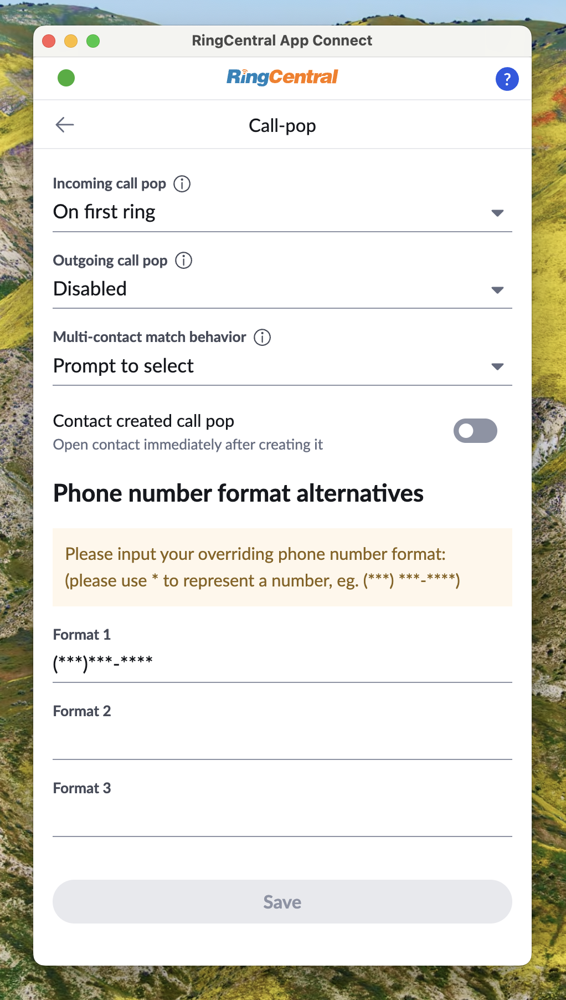
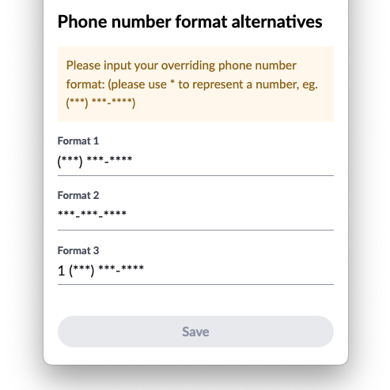

# Setting up App Connect for Clio

Clio provides legal client relationship management software to help law firms manage business development functions such as client intake, client scheduling and follow-up, revenue tracking, and more. In short, Clio addresses the client intake process of turning potential new clients into retained clients.

RingCentral's integration with Clio helps streamline communications with clients, and helps staff servicing clients to better support them through the entire intake process by helping to manage and store communication history with clients, report on billable time and more.

## Install the extension

If you have not already done so, begin by [installing App Connect](../getting-started.md) from the Chrome web store. 

<iframe width="825" height="464" src="https://www.youtube.com/embed/pQgdsAR1UCI?si=PaSTDhHkTUa9fMtk" title="App Connect for Clio - quick start" frameborder="0" allow="accelerometer; autoplay; clipboard-write; encrypted-media; gyroscope; picture-in-picture; web-share" allowfullscreen></iframe>

## Setup the extension

Once the extension has been installed, follow these steps to setup and configure the extension for Clio. 

1. [Login to Clio](https://account.clio.com/).

2. While visiting a Clio application page, click the quick access button to bring the dialer to the foreground. 

3. Navigate to the Settings screen in App Connect, and find the option labeled "Clio."

    { .mw-300 }

4. Click the "Connect" button. 

5. A window will be opened prompting you to enter your Clio username and password. Login to Clio. 

When you login successfully, the Chrome extension will automatically update to show you are connected to Clio. If you are connected, the button next to Clio will say, "logout".

And with that, you will be connected to Clio and ready to begin using the integration. 

## Setting up phone number matching to properly match contacts

Clio's contact lookup method is very strict. As a result, if the phone numbers in Clio are not stored using the E.164 standard, e.g. `+1##########`, then App Connect will fail to find the contact record for call logging and call pop. 

To address this, short of reformatting every phone number stored in Clio, is to go to [Phone number format alternatives](../users/phone-number-formats.md) under the "Call pop" settings and set the phone number formats to conform with the conventions used by your practice. 

{ .mw-300 }
  
Navigate to App Connect's Contacts settings page and enter in the phone formats used by your practice. Define a format by using an asterix "*" in place of any digit/number. Any other character used in the format string will be interpretted literally. 

Let's look at a few examples. First, consider the following format string:

    (***) ***-****
	
| Phone number     | Does it match? |
|------------------|----------------|
| (555) 123-2334   | Yes            |
| (555)123-2334    | No             |
| 1 (555) 123-2334 | No             |
| 555-123-2334     | No             |

Now, let's look at one more example. Consider the format string:

    1 (***) ***-****
	
| Phone number      | Does it match? |
|-------------------|----------------|
| 1 (555) 123-2334  | Yes            |
| +1 (555) 123-2334 | No             |
| (555) 123-2334    | No             |
| 555-123-2334      | No             |

We have found the following formats are commonly used among customers (feel free to copy and paste them into advanced settings):

* `(***) ***-****`
* `***-***-****`
* `***.***.****`
* `1 (***) ***-****`

Select or enter up to three different formats used by your practice and click "Save." 

<figure markdown>
  
  <figcaption>Phone number formats after being properly filled in.</figcaption>
</figure>

!!! tip "The E.164 format is used by default. You do not need to specify the format `1**********`."

Making this change will improve your experience with the extension considerably. Here are a few things to bear in mind:

* Every phone number format you add results in another search request to Clio, which could lead to performance issues.
* Searches are performed using each of the formats in order. The first phone number that is found will stop the search process. So place the formats that are most likely to yield results first in order. 

### Improving contact lookup speeds

Ideally, phone numbers in Clio would all be stored using the E.164 format standard. This would eliminate the need to resort to searching using different formats. Therefore, one thing you can do within your company is socialise with Clio users the value of storing phone numbers in a specific format. 

!!! tip "Use Zapier to automatically format phone numbers"
    Zapier is a great automation tool that can help your organization [reformat phone numbers to E.164](https://zapier.com/apps/clio/integrations/formatter/1481647/format-numbers-for-new-clio-contacts-with-formatter-by-zapier) for all new contacts moving forward.
    

Finally, you can improve performance by going back to existing contacts and updating their phone numbers. This can be a laborious process, but will yield the best results in the long term. 
