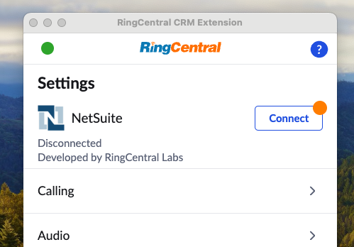

# Setting up App Connect for NetSuite

NetSuite is a cloud-based business management software that helps organizations manage their financials, operations, and customer relationships.

RingCentral's integration with NetSuite helps streamline communications with contacts, and helps staffing agents better support contacts through the entire sales order pipeline by helping to manage and store communication history for all contacts. 

!!! warning "Prerequisites"
    * The current version of the NetSuite integration requires NetSuite version 2024.1 or later. 
    * NetSuite users must have [REST Web Services](https://docs.oracle.com/en/cloud/saas/netsuite/ns-online-help/section_1544787084.html#Related-Topics) enabled. 
	* NetSuite OneWorld license holders will need to manually add the "Subsidiaries" permission to the role they use to connect to NetSuite. 

## Install the SuiteApp

To begin using the NetSuite integration, users will first need to do the following:

* Login to NetSuite, then visit the [RingCentral Suite App](https://www.suiteapp.com/RingCentral-Unified-CRM-Extension) page, or:
  * Click on the "SuiteApps" tab if your role gives you access to it
  * Search for "RingCentral" in the directory
  * Click "RingCentral Unified CRM Extension" in the search results
* Click the "Install" button found in the upper right hand corner of the page

If you see, "Not compatible" in place of an "Install" button, then you must be running an older version of NetSuite. You will need to upgrade to 2024.2 or later. 

Installing the app from the SuiteApp marketplace is a necessary step prior to installing the Chrome extension discussed below. 

## Setup roles and permissions in NetSuite

Upon installation of the SuiteApp, a role will be created automatically within your account called "RingCentral CRM Extension." This role has been specially tuned to contain the bare minimum number access level to fully operate the Chrome extension. You can see a detailed list of permissions below if you would like to incorporate these permissions into a custom role of your own. 

### NetSuite OneWorld instructions

Upon installing the SuiteApp from the Marketplace, a new custom role named **"RingCentral CRM Extension"** will be automatically created in your account. If you are a OneWorld license holder, you will need to take these additional steps.

1. Clone the "RingCentral CRM Extension" role by selecting the "Customize" option.
2. While cloning, add the permission **"List -> Subsidiaries"** to the cloned role.

Use this cloned role when logging into and connecting App Connect to NetSuite.

!!! info "The role is created by SuiteApp locked by default and cannot be edited. If you wish to make modifications, you may duplicate the role by clicking on 'Customize.'"

### Turn on REST web services

REST Web Services is default to be invisible. We'll need to turn on the feature so to make it selectable for roles. Here's how to do it:

1. From NetSuite homepage, go to Setup -> Company -> Enable Features
2. Go to sub-tab, "SuiteCloud"
3. Tick on "REST Web Services" and save

### Create role with required permissions

We recommend using the "RingCentral CRM Extension" role created for you when you install the SuiteApp. However, if you would like to create a custom role that includes the permissions necessary to allow this extension to operate fully, consult the table below. 

| Category     | Permission                           | Level                       |
| ------------ | ------------------------------------ | -----                       |
| Lists        | Contacts                             | Full                        |
| Lists        | Customers                            | Full                        |
| Lists        | Phone Calls                          | Full                        |
| Lists        | Subsidiaries                         | View  (OneWorld users only) |
| Reports      | SuiteAnalytics Workbook              | Edit                        |
| Setup        | Log in using OAuth 2.0 Access Tokens | Full                        |
| Setup        | REST Web Services                    | Full                        |
| Setup        | User Access Tokens                   | Full                        |
| Transactions | Sales Order                          | Full                        |

## Install the Chrome/Edge extension

If you have not already done so, begin by [installing App Connect](../getting-started.md) from the Chrome web store. 

<iframe width="825" height="464" src="https://www.youtube.com/embed/yo4Q1Vj-sH4" title="App Connect for NetSuite - quick start" frameborder="0" allow="accelerometer; autoplay; clipboard-write; encrypted-media; gyroscope; picture-in-picture; web-share" allowfullscreen></iframe>

## Setup the extension

Once the extension has been installed, follow these steps to setup and configure the extension for NetSuite. 

1. [Login to NetSuite](https://system.netsuite.com/pages/customerlogin.jsp).

2. While visiting a NetSuite web page, click the quick access button to bring the dialer to the foreground. 

3. Navigate to the Settings screen in App Connect, and find the option labeled "Netsuite".

    { .mw-200 }

4. Click the "Connect" button. 

5. A window will be opened prompting you to allow OAuth scopes. Allow it.

When you login successfully, the Chrome extension will automatically update to show you are connected to NetSuite. If you are connected, the button next to NetSuite will say, "logout".

And with that, you will be connected to NetSuite and ready to begin using the integration. 

## Placeholder companies when creating contacts

NetSuite requires that every contact be associated with a company. When logging calls for new contacts, App Connect will first look for a company called, "Placeholder company." If a company with that name is not found, one will be created. Then the contact will be associated with that company record. It is the intent that once the call is complete that an agent do one of the following:

1. Edit the company called "Placeholder Company" with a more appropriate name and with additional details.
2. Edit the contact to associate it with a more appropriate company stored in NetSuite. 

In this way, App Connect ensures that all contacts created by it conform to the requirements of NetSuite so that all contact records are complete. 
