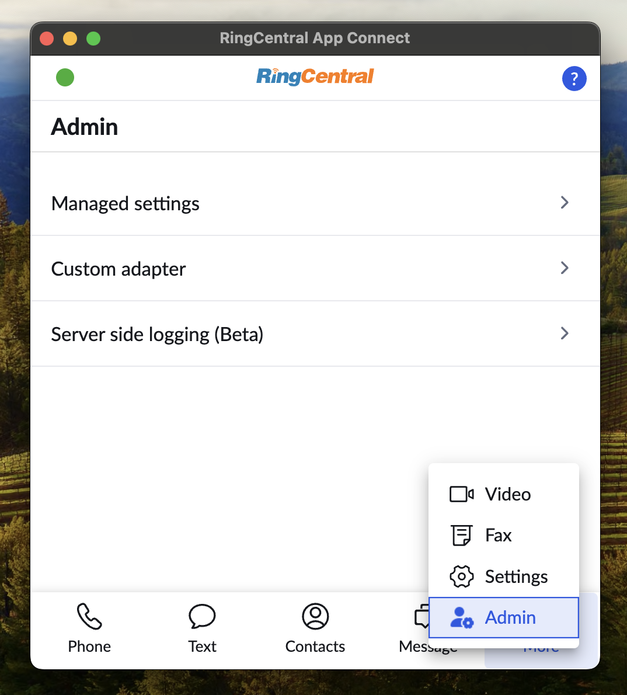

# Managing user settings across your account

Super Admins within your RingCentral account have access to an additional area of App Connect in which they can manage the end user's experience across their entire account. This feature primarily allows admins to set certain preferences, or mandate certain preferences across their entire account. This allows admins for example to mandate that all calls across an account be logged. Or that specific settings be employed for their CRM. 

<figure markdown>
  { .mw-400 }
  <figcaption>The admin tab in App Connect gives admins the ability to manage settings on behalf of others</figcaption>
</figure>

## Gaining access to the admin tab

When you first load App Connect, you may not see the Admin tab. To make the Admin tab appears please check the following:

1. Make sure you possess the "Super Admin" role in the RingCentral [Admin Console](https://service.ringcentral.com/).
2. Connect to your CRM

## Managing settings on behalf of others

Once you have access to the Admin tab, admins can manage the following:

* Call and SMS logging settings
* Contact and call-pop settings
* CRM-specific settings
* Advanced settings
* Set the custom CRM manifest URL

<figure markdown>
  { .mw-400 }
  <figcaption>Admins can set call logging policies</figcaption>
</figure>

For each setting that can be managed by an admin, one can do the following:

* Mandate the setting be a specific value. This is done by disabling the user's ability to customize the value, and select the value you prefer. 
* Set the default value of a setting. This is done by setting the preferred value, and by enabling the user to customize the value. 

### What users within your account will see

When a setting is mandated by an admin, a lock icon will appear next to the setting and it will be disabled, thereby allowing the user to see the value, but be unable to change it. 

<figure markdown>
  { .mw-400 }
  <figcaption>Admins can manage CRM-specific settings</figcaption>
</figure>

## Managing CRM-specific settings

Each CRM supported by App Connect may expose custom settings. These settings can be managed under the area labeled as "Custom options."

<figure markdown>
  { .mw-400 }
  <figcaption>Admins can manage CRM-specific settings</figcaption>
</figure>

## Managing custom adapter settings

App Connect enables developers to build custom adapters to connect to proprietary CRMs, or CRMs not supported natively by App Connect. Users can load a custom adapter under "Developer Settings." Admins however can manage this setting across their entire account under the "Custom adapter" area of the Admin tab. 

## Server side logging (Beta)

Server-side logging offers an alternative to triggering call logging into the CRM from the Chrome extension. With this feature, call data is synchronized directly from the cloud. This means that even if the Chrome extension is closed, or if users make calls using other devices, the call information will still be logged in the CRM.

Currently, this feature is in beta, and there are something you need to know:

1. Enabling server-side logging will disable client-side auto call logging.
2. Calls to the main company number that are dropped before being redirected to an extension will not be logged.
3. When a call is made to the main company number and redirected to a user, the call duration recorded may appear longer than the actual time spent by the user. This is because the recorded duration includes the time taken for the call to be redirected.

