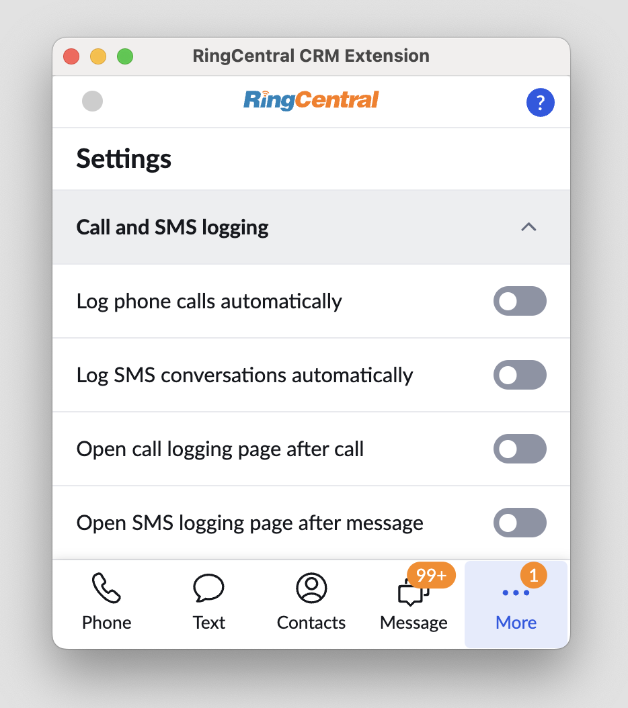
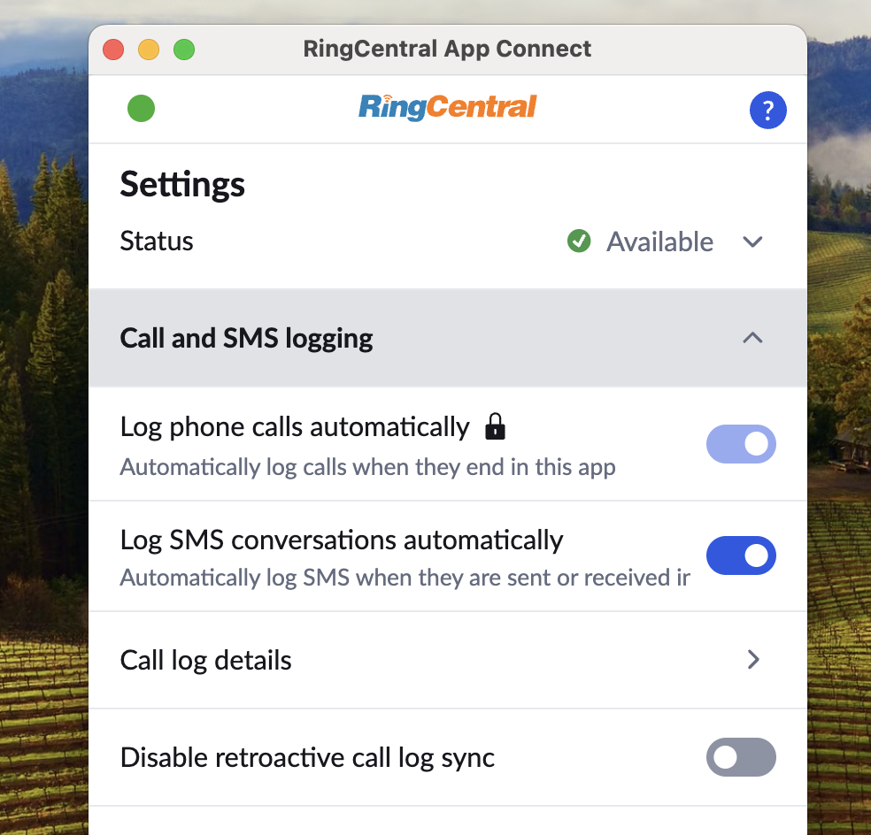

# Automatically logging calls

App Connect has the ability to automatically log calls. How exactly this feature behaves depends upon your configuration, and whether you have elected to use our basic "client-side" logging feature, or [server-side call logging](server-side-logging.md).

## Client-side vs server-side logging

The main difference between these two options is when the call is logged. When using App Connect's basic client-side logging feature (this is the default configuration) calls are only logged when the App Connect window is open. Conversely, when server-side call logging is enbaled, calls are logged in real-time, the moment the call ends. 

|                                             | Client-side        | Server-side        |
|---------------------------------------------|--------------------|--------------------|
| Real-time logging                           | :no_entry:         | :white_check_mark: |
| User required to have App Connect installed | :white_check_mark: | :no_entry:         |
| Control whose calls get logged              | :white_check_mark: | :white_check_mark: |
| Automatic conflict resolution               | :no_entry:         | :no_entry:         |

### Client-side logging limitations

App Connect has the ability to automatically log calls for its users. Rest assured, App Connect will log all calls it is able to, regards of whether you have select client-side or server-side logging. However, it is important customers understand certain limitations with client-side logging. 
	
* It CAN automatically log the calls for any user who has the extension installed, and has connected the extension to both RingCentral and their CRM.
* It CANNOT log calls for anyone who does not have the extension installed in their browser. 
* It CANNOT log calls for anyone who has not connected the extension to their CRM. 
* It CANNOT log calls automatically for people whose browser is closed. 
* It CANNOT log calls automatically for people whose App Connect window is closed. 
	
## Setting up automatic call logging

App Connect can be configured to log calls automatically so that you do not need to remember to do so manually. To log calls automatically, there are two configuration parameters that are relevant to you. Both of these parameters can be found under Settings accessed from the More tab.

If you wish to utilize [server-side call logging](server-side-logging.md), the setup process is a little different. 

<figure markdown>
  { .mw-400 }
  <figcaption>Settings screen in App Connect to enable automatic call logging</figcaption>
</figure>

### Settings

| Setting | Description |
|---------|-------------|
| **Log phone calls automatically** | This toggles the auto log feature which will always attemp to log your calls/messages unless any conflict is found. |
| **Open call logging page after call** | This is a sub-setting under auto log. When enabled, App Connect will open a call logging page when a call ends. If auto-logging is also enabled, then the call will be logged and then the log form will be opened giving you a chance to make edits to what was logged. | 

### Retroactively logging calls

Automatic call logging allows for calls to be logged, even if you are not actively using your CRM, or taking calls through App Connect. However, there is one key restriction everyone should be aware of: calls cannot be logged if App Connect is closed. Luckily, when you open App Connect, and if automatic call logging is enabled, then App Connect will attempt to log any calls that were not logged while it was closed. 

!!! info "Retroactively logging calls may take time"
	To help prevent server overload, App Connect will retroactively log calls in the background slowly over time, processing calls in groups of ten every minute for ten minutes. Therefore, it will only attempt to log 100 calls in this way. If you failed to log more than 100, then the remainder will need to be logged manually. 

You can disable retroactive call logging under "Call and SMS logging" settings area. 

<figure markdown>
  { .mw-400 }
</figure>
