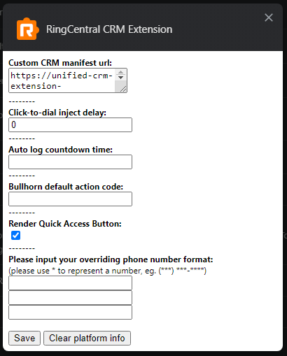

## Advanced configuration options

Most users will not need to access these advanced configuration options. However, they have been provided to assist in resolving less common, low-level challenges. These options can be accessed both in Chrome and Edge by opening the "Manage Extensions" area from the Window menu, or from the extension menu found adjacent to your browser's location bar. 

* Open [Manage extensions](chrome://extensions/) in Chrome
* Open [Manage extensions](edge://extensions) in Microsoft Edge

**Finding advanced settings**

To access advanced settings, in your browser, navigate to "Manage Extensions," or just "Extensions." From there locate "RingCentral App Connect" and click "Show Details."

<figure markdown>
  { .mw-400 }
  <figcaption>An excerpt from the extension details page for App Connect</figcaption>
</figure>

Then scroll down near to the bottom and click "Extension options" to open the dialog below.

<figure markdown>
  { .mw-400 }
  <figcaption>App Connect extension options. Users may see a slightly different set of options depending upon the version they are using.</figcaption>
</figure>

## Click-to-dial inject delay

App Connect's phone/dialer is injected into the CRM via a mechanism that some web servers will reject. This is circumvented by delaying the loading of the CTI by a couple of seconds. This config parameter controls this delay. 

*This should only be used in rare circumstances.*

CRMs known to need this parameter set are:

* Pipedrive

## Render quick access button

App Connect injects a small handle in the lower right hand corner of your CRM. Some users have expressed concern that this handle obscures the page content, and therefore wish to remove it. Toggle this parameter to turn off/on the dialer handle in the lower-righthand corner. 

*Disabling the quick access button does not impact the operability of the extension.*
