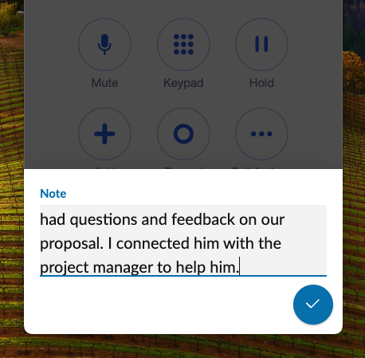
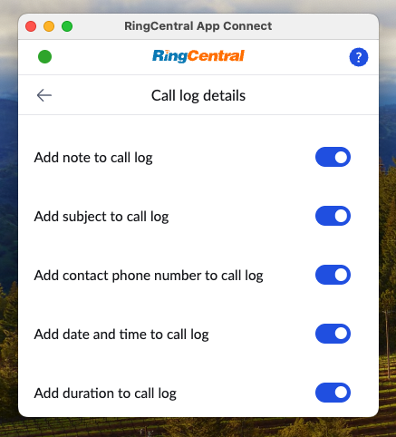
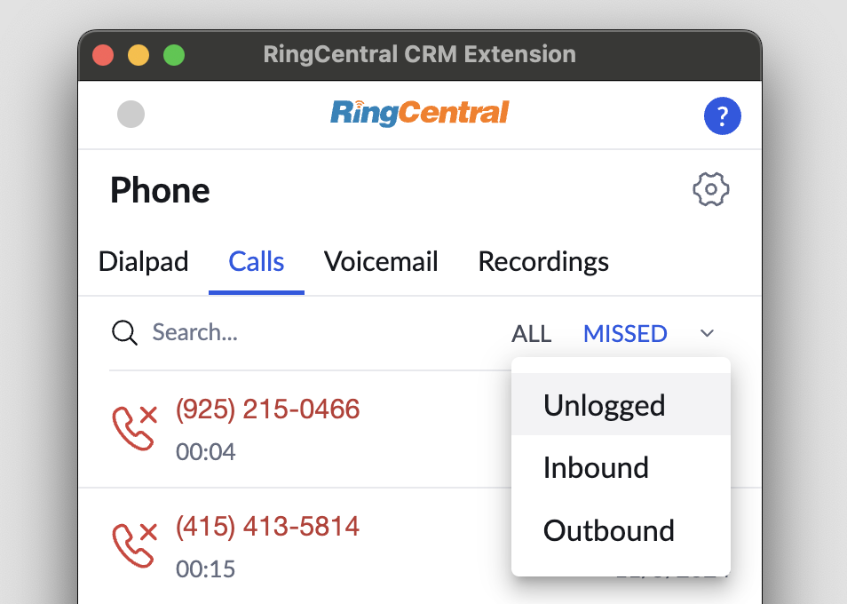

# Logging phone calls in your CRM

App Connect’s call logging system is designed to help users efficiently track and manage their calls. It offers the following features and capabilities:

* **Manual Call Logging** – Users can choose to log calls selectively by clicking the call log button in their call history.
* **Automatic Call Logging** – Calls can be logged automatically based on user preferences and system configuration.
* **Multi-Device Support** – Calls made or received on mobile devices, the RingCentral desktop app, or within App Connect itself are all logged automatically.
* **Custom CRM Fields** – Adapt to your CRM’s specific requirements by ensuring the correct fields are completed for each logged call.
* **Retroactive Call Logging** – Missed or unlogged calls are automatically recorded when you install or reopen App Connect after a period of inactivity.

## Call logging sequence

It may take some time in order for a call log's record in the CRM to be complete, because many artifacts of a call take time to prepare. For this reason a call log is generated in stages. Below is the call logging sequence.

1. **Call is completed**. Within a few seconds of the call completing, a record in the CRM is created. At this stage App Connect will log the fundamental basics of the call, including things like the start/stop time, the duration, the participants. 
2. **Call notes** (optional). If a user has manually entered notes about a call, then the call log record created in step 1 will be updated to include the user's notes. 
3. **Call recording is prepared**. It takes about as long as the call lasted to prepare a call recording file for playback and download. When this process is complete, the call log record created in step 1 will be updated to include a link to the call recording.
4. **AI artifacts are generated**. If you are a RingSense subscriber, then when the call summary, transcript and other artifacts are generated, the final attempt to update the call log record created in step 1 will be updated with this information. 

!!! tip "Do not edit a call log record until it is complete"
    App Connect updates your call log record multiple times before it is complete. Until it is complete, if you make any edits to the record in the CRM you run the risk of losing those edits when the call log is updated by the framework. 
	
!!! info "Needed permissions for successful call log updates"
    Some customers have a policy that states agents can only create call logs, they are NOT permitted to update call logs. Be aware, this policy will make it difficult for App Connect to successfully create a complete log entry for a call, as it requires the ability to update records. Look into [server side call logging](server-side-logging.md) as a possible remedy. 

## Taking notes during an active call

While a call is active, click the "Notes" icon found in the lower right-hand corner of the dialer to open up a notes page into which you free type notes. When the call is complete, the notes will be saved locally, and when you log the call in the CRM the notes will transmitted to and saved in the CRM.

<figure markdown>
  
  <figcaption>Users can take notes during a phone call that can later be logged into a CRM.</figcaption>
</figure>

## Controlling what information gets logged

There is a lot of potential information about a call that can be logged. Depending upon your needs you may wish to modify what information is summarized and displayed in the logged call's record. Below is a list of the data available to be logged:

* **Subject** - this acts as a one-line summary of the call, usually in the form of "Inbound call from **name**"
* **Notes** - this refers to the human-entered notes for the call
* **Contact phone number** - the phone number that was called or called you
* **Date/time** - the start and end date/time of the call
* **Duration** - the duration of the call
* **Call result** - what did RingCentral observe as the result of the call, e.g. "call connected," "voicemail," "missed," etc. 
* **Recording** - if there is a recording for the call, a link to the recording will be embedded 
* **AI notes/summary** - AI-generated summary of the call (requires RingSense subscription)
* **Transcipt** - A transcript of the call (requires RingSense subscription)

<figure markdown>
  { .mw-400 }
  <figcaption>Settings screen to control what information to log in your CRM</figcaption>
</figure>

## Logging calls manually

All calls made or received can be logged manually. To manually log a call, open the "Calls" tab in App Connect, find the call you wish to log in the list, and click the call log icon. You will then be prompted to enter notes and other required fields in order to log the call in the connected CRM. Clicking "save" will result in the call being logged and associated with the proper contact. Any notes entered by the user will also be saved with the associated activity.

<figure markdown>
  { .mw-400 }
  <figcaption>App Connect's call history page</figcaption>
</figure>

### Filtering call history for unlogged calls

It might be helpful from time to time to quickly assess and remedy any calls that have not yet been logged. To see a list of calls that have not yet been logged, select "Unlogged" from the list of available filters. 

<figure markdown>
  { .mw-400 }
  <figcaption>App Connect's filtered list of "Unlogged" calls</figcaption>
</figure>

## Logging call recordings

If a call is recorded, a link to the call's recording is included in the contents logged to the CRM automatically. 

!!! info "Call recording links are generated with certain delay"
    Please be aware that it takes time for RingCentral server to process and upload your recordings, therefore recording links won't be generated immediately after calls. The delay could be seconds to minutes dpending on duration of the call and RingCentral server's current capacity.  

!!! warning "App Connect does not archive the recording file"
    By default, App Connect will only generate a link to the call recording stored in RingCentral. Unless call archiving is explicitly supported by the CRM's adapter, you may need to explore alternative solutions for reliable off-site storage of call recording files. 

!!! warning "Call logs are kept for a maximum of 90 days within RingCentral"
    Please be aware that RingCentral does not retain data indefinitely. Call recordings for example are purged after 90 days. If you wish to retain those files longer, most users subscribe to a third-party service to archive call media. When call recordings are removed from RingCentral, the links in your CRM may expire. 

## Logging past calls

App Connect has the ability to automatically log calls in your connected CRM (see [Automatic call logging](automatic-logging.md)). However, unless you are using [server-side call logging](server-side-logging.md), in order for calls to be logged, the extension must be actively running. So if you receive a call overnight for example, the call will not be logged until the next time you access App Connect. 

